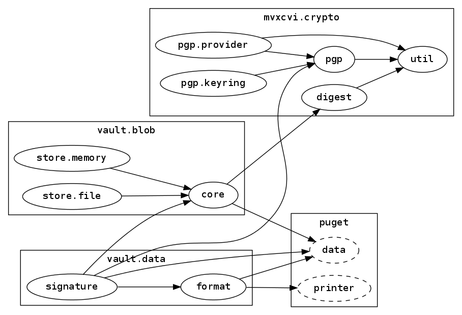

lein-hiera
==========

Generates a graph of the dependency hierarchy of a set of clojure files. This
uses the [clojure.tools.namespace](https://github.com/clojure/tools.namespace)
library for namespace parsing and [Rhizome](https://github.com/ztellman/rhizome)
for graph generation using [Graphviz](http://www.graphviz.org/).

This plugin is inspired by
[lein-ns-dep-graph](https://github.com/hilverd/lein-ns-dep-graph), but has many
additional options for graph generation.


## Installation

Plugin releases are published on Clojars. To use the latest verison with
Leiningen, add the following to your project definition or user profile
plugins:

[](http://clojars.org/lein-hiera)

You'll also need Graphviz installed, in order to generate the graph images.
Check your local package manager:

```
# Debian/Ubuntu:
$ sudo apt-get install graphviz

# OS X:
$ brew install graphviz
```


## Usage

A namespace graph can be generated by running:

```
$ lein hiera
```

This will generate a dependency graph in `target/ns-hierarchy.png`, showing the
interdependency of the project's source namespaces. By default, all directories
in the project's `:source-paths` are included. Additional directories to include
may be given as command-line arguments:

```
$ lein hiera ../foo-lib/src ../bar-lib/src
```

You can also override the configuration options by specifying them on the
command line with keyword arguments:

```
$ lein hiera :cluster-depth 3 :dot target/namespaces.dot
```


## Example

This image shows the dependency hierarchy from a moderately complex project. The
namespaces are clustered by two levels, and it shows a dependency on the external
`puget` library.




## Options

Graph generation may be controlled with additional options under the `:hiera`
key in the project map or provided on the command line. The available options,
and their default values are:

| name              | default                 | description |
|-------------------|-------------------------|-------------|
| `:dot`            | (none)                  | If set, save the raw DOT graph to this path.
| `:path`           | target/ns-hierarchy.png | The location to output the graph image to.
| `:vertical`       | true                    | Specifies whether to lay out the graph vertically or horizontally.
| `:show-external`  | false                   | When set, the graph will include nodes for namespaces which are not defined in the source files, marked by a dashed border.
| `:cluster-depth`  | 0                       | Sets the number of namespace segments to cluster nodes by. Clusters must contain at least one fewer segment than the nodes themselves.
| `:trim-ns-prefix` | true                    | When set, clustered namespaces will have the cluster prefix removed from the node labels.
| `:ignore-ns`      | (none)                  | A set of namespace prefixes to exclude from the graph. For example, `#{clojure}` would exclude `clojure.string`, `clojure.java.io`, etc.


## License

This is free and unencumbered software released into the public domain.
See the UNLICENSE file for more information.
